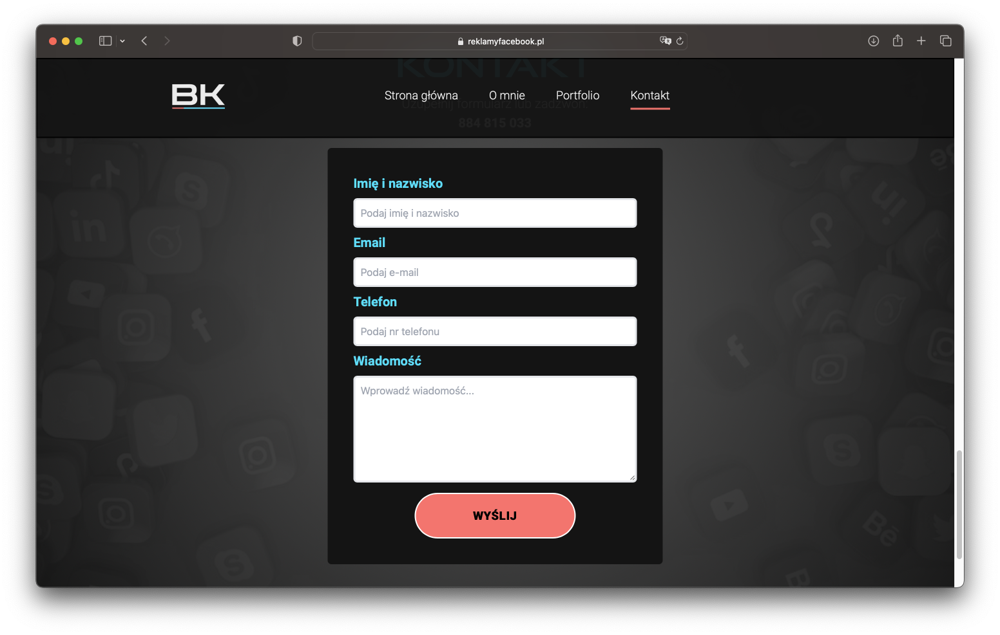
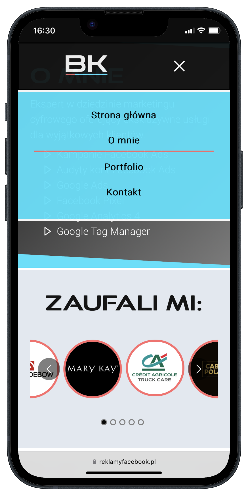

# marketing-portfolio
The goal of the project was to build a modern portfolio website for a marketing professional, so the clients can easily find key details and quickly get in touch.

🌐 [Marketing portfolio website live](https://www.reklamyfacebook.pl/)

<h3>Goals</h3>

This is a modern portfolio website for online marketing specialist. Developed with focus on performance, responsive design and clean, futuristic design.

The project of this type was a perfect excuse for me to pick up Next.js, TypeScript and Tailwind CSS, as I haven't worked with these technologies before. Next.js naturally felt a good fit because the app is frontend heavy, but there was still a need to handle some backend requests as well.

My job was to create graphic design for the website, prepare color palette, build the whole application and deploy it.

<h3>Technologies</h3>
     
   
   

  

<h3>Key features</h3>
<ul>
  <li>Automated contact form handling with Nodemailer library. Email with user data sent immediately after form is submitted</li>
  <li>Contact form validation written with the help of Formik and Yup libraries</li>
  <li>State management with hooks from React</li>
  <li>Performance-driven, optimized for speed and efficiency</li>
  <li>Focus on intuitive and user-friendly interface</li>
  <li>Accessibility features adjusted for better screen reader performance
  <li>Excellent performance on mobile devices</li>
  <li>Smooth animations with Framer Motion library to enhance user experience</li>
  <li>UI written with Tailwind CSS</li>
  <li>Carousel and accordion items used to display clients and case studies in a user-friendly manner</li>
</ul>

This project pushed my understanding of modern web development to a new level. These days I am even more aware of notions like accessibility, performance or responsive design.

<h3>Visual representation</h3>

  

<h3>More details</h3>
For more information on this and other projects, please check my website:

🌐 [Mateusz Kuruc - JavaScript Developer](https://www.mateuszkuruc.com/)

In case of any questions, feel free to contact me directly.
